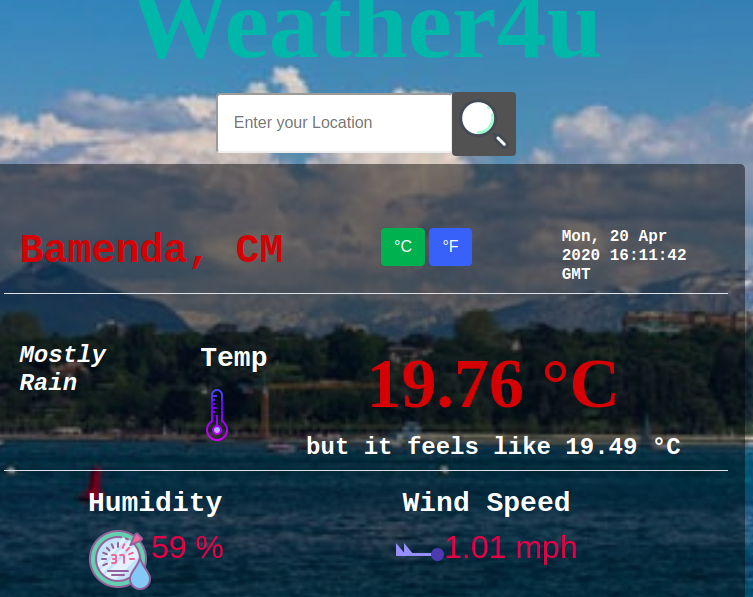

# Weather App
This project involves implementing aynchronous javascript via async/await and Promises to build a weather forecast app from the openweather site API.

## Live Demo Link

[Live Demo Link](https://raw.githack.com/Datagirlcmr/Weather-App/feature/dist/index.html)

=======

## Live Version

## Get Started

- Download or clone this [repo](https://github.com/Datagirlcmr/Weather-App) here.
- Install webpack and other project dependencies by running

        npm install

- Run 

        npm run dev

to watch your files
- Open index.html file 
- Enter your location and view the weather data.

## Built With

- HTML, CSS, Bootstrap, Javascript
- OpenWeather API
- Webpack for bundling
- Vscode for coding
- ESLint for Validation

For more information, see the
[*The Odin Project*](https://www.theodinproject.com/courses/javascript/lessons/weather-app).

## Author

👤 **Selma Ndi**

- Github: [@githubhandle](https://github.com/Datagirlcmr)
- Twitter: [@twitterhandle](https://twitter.com/SelmaNdi)
- Linkedin: [linkedin](https://www.linkedin.com/in/selma-ndi-datagirl-imba-8976ab32/)

Contributions, issues and feature requests are welcome! 

Feel free to check the [issues page](https://github.com/Datagirlcmr/Weather-App/issues).
